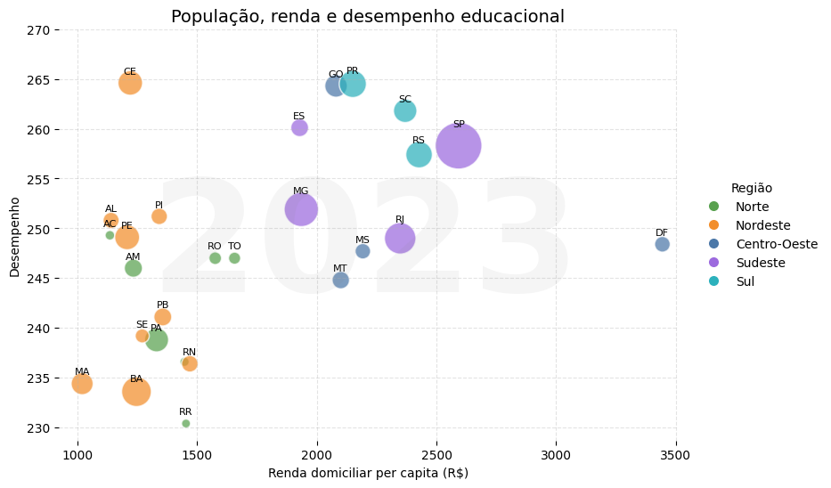
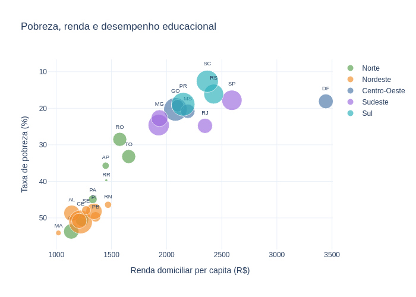
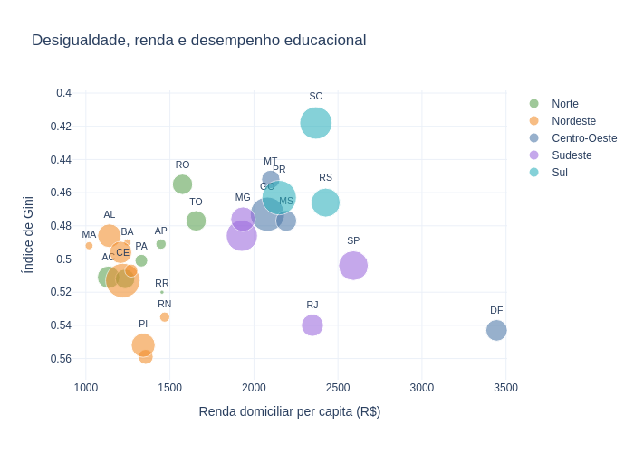
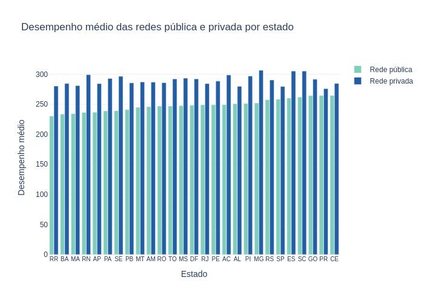
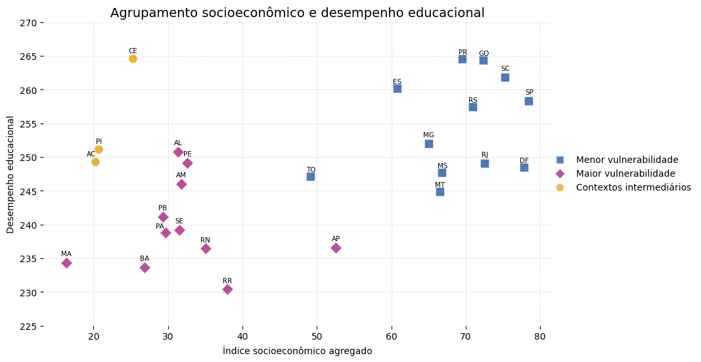
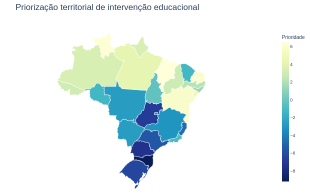
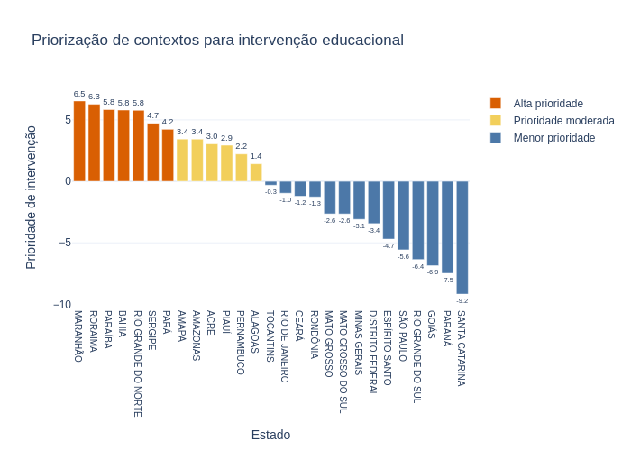
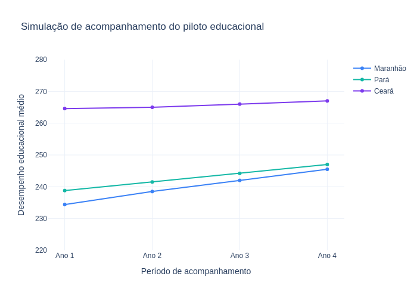

# Data and Education: Prioritizing Educational Interventions in Brazil

Data-driven socioeducational analysis focused on identifying educational vulnerabilities, prioritizing interventions, and supporting evidence-based decision-making in Brazilian public education.

---



*Visualization inspired by the Gapminder approach to explore relationships between social development, socioeconomic vulnerability, and educational performance across Brazilian states.*

---

## Overview

**Dataset:** educational and socioeconomic indicators from Brazilian states  
**Sources:** IBGE, SAEB / INEP and Brazilian public educational datasets  
**Techniques:** exploratory data analysis, linear regression, clustering, educational prioritization and intervention monitoring simulation  

**Key insight:** Ceará achieved the highest public education performance in the analysis, while Maranhão, Roraima, and Paraíba presented the highest relative levels of educational intervention priority, reinforcing that similar socioeconomic contexts may produce very different educational outcomes.

---

## Interactive Dashboard

This project also includes an interactive dashboard developed with Streamlit and Plotly:

🔗 https://vanessa22400-analise-intervencao--dashboard-streamlitapp-kcbej6.streamlit.app/

---

## Project Context

Educational inequality in Brazil is strongly associated with socioeconomic and regional factors. However, states with similar socioeconomic conditions may present significantly different educational outcomes.

This project integrates public educational and socioeconomic indicators to explore relationships between educational performance, social vulnerability, and intervention prioritization across Brazilian states.

The proposal aims to demonstrate how data-driven analysis can support prioritization processes, monitoring strategies, and evidence-based decision-making in public education policies.

---

## Objectives

- identify relationships between socioeconomic indicators and educational performance
- compare educational disparities across Brazilian states and regions
- analyze differences between public and private education systems
- develop a socioeconomic vulnerability score
- build a simplified educational prioritization model
- identify contexts with greater potential for educational intervention
- simulate monitoring processes for a data-oriented educational pilot program

---

## Dataset

The project combines public educational and socioeconomic indicators from Brazilian states, integrating variables related to educational performance, income, poverty, inequality, and urbanization.

### Main variables analyzed

- public education performance
- private education performance
- household income
- poverty rate
- Gini inequality index
- schooling indicators
- urbanization
- population

### Data sources

- IBGE
- SAEB / INEP
- Brazilian public educational indicators

---

## Methodology

The analysis was structured into the following stages:

1. Data integration and preprocessing  
2. Exploratory Data Analysis (EDA)  
3. Gapminder-inspired visualizations  
4. Linear regression analysis  
5. Regional comparisons  
6. State clustering analysis  
7. Socioeconomic vulnerability score construction  
8. Educational intervention prioritization model  
9. Data-oriented educational pilot proposal  
10. Monitoring and intervention simulation  

---

## Main Results

<p align="center">
  
  
</p>

*Gapminder-inspired visualizations exploring relationships between income, poverty, inequality, and public educational performance across Brazilian states.*

---

- Public educational performance showed a relevant relationship with the socioeconomic indicators analyzed, although these factors alone did not fully explain the differences observed between states with similar regional characteristics.

- While socioeconomic indicators followed relatively similar regional patterns, educational performance varied considerably between states within the same region.

- Ceará achieved the highest public education performance in the analysis (**264.6 points**), despite belonging to one of the historically more vulnerable regions of Brazil. Piauí and Pernambuco also demonstrated relatively strong educational performance within similar socioeconomic contexts.

- States with more favorable socioeconomic indicators, such as the Federal District, did not necessarily achieve proportionally superior educational outcomes.

- All states presented higher performance in private education compared to public education. The largest differences were observed in **Rio Grande do Norte (+26.5%)**, **Sergipe (+23.9%)**, and **Minas Gerais (+21.6%)**, while **Paraná (+4.3%)** and **Ceará (+7.5%)** presented the smallest relative gaps.

- Santa Catarina presented one of the most balanced results in the analysis, combining high educational performance (**261.8 points**), low poverty levels (**12.6%**) and lower inequality (**Gini = 0.418**).

---

## Public vs Private Education Analysis

In addition to public education performance, the project also explored differences between public and private education systems across Brazilian states.



The analysis showed that:

- private education achieved, on average, approximately **16.9% higher performance** than public education across the analyzed states
- all states presented higher performance in private education
- educational gaps varied considerably between states
- **Rio Grande do Norte**, **Sergipe**, and **Minas Gerais** presented the largest relative educational gaps, with differences above **20%**
- **Paraná** and **Ceará** presented the smallest relative differences between public and private education, with gaps below **8%**
- no single regional pattern fully explained the largest educational disparities

---

## Clustering and Educational Profiles

The clustering analysis identified distinct socioeconomic and educational profiles across Brazilian states.



The results reinforced that:

- states within the same region may present very different educational outcomes
- socioeconomic indicators alone do not fully explain educational performance
- multidimensional analysis is important for supporting educational intervention strategies

---

## Educational Intervention Prioritization

By combining socioeconomic vulnerability and educational performance indicators, the project developed a simplified educational prioritization model.

The model identified states with greater relative potential for targeted educational interventions.



### States classified with highest relative intervention priority

- Maranhão
- Roraima
- Paraíba
- Bahia
- Rio Grande do Norte
- Sergipe
- Pará

<p align="center">
  
</p>

*States from historically more vulnerable regions concentrated the highest relative levels of educational intervention priority.*

---

## Educational Pilot Proposal

Based on the results observed throughout the analysis, the project developed a simplified data-oriented educational pilot proposal.

The proposal focuses mainly on:

- states classified with higher relative intervention priority
- continuous educational monitoring
- performance tracking
- pedagogical support and educational technology

The project also used Ceará as an important comparative reference due to its educational performance above the trend observed for similar socioeconomic contexts.

---

## Monitoring Simulation

A simplified four-year educational monitoring simulation was developed.

The proposal aimed to illustrate how educational indicators could support:

- continuous monitoring
- impact evaluation
- educational performance tracking
- data-driven intervention prioritization

States included in the simulation:

- Maranhão
- Pará
- Ceará (comparative reference)



---

## Practical Applications

The project may contribute to:

- educational policy prioritization
- public indicator monitoring
- simplified impact evaluation
- identification of vulnerable educational contexts
- educational goal tracking
- evidence-based educational planning

---

## Limitations

Some limitations should be considered:

- use of state-level aggregated data
- absence of longer historical time series
- limited availability of some public indicators
- use of simplified hypothetical simulations

---

## Future Developments

Possible future expansions include:

- municipal-level analysis
- integration of school dropout indicators
- historical educational time series
- predictive models for dropout risk identification
- integration with real monitoring indicators
- educational time-series forecasting models
- analysis of specific public education policies
- interactive monitoring dashboards

---

## Project Structure

```bash
.
├── data
├── notebooks
├── images
├── requirements.txt
└── README.md
```

---

## Analytical Pipeline

```text
Data collection
→ exploratory analysis
→ regression analysis
→ clustering
→ vulnerability scoring
→ educational prioritization
→ monitoring simulation
→ practical applications
```

---

## Technologies Used

- Python
- Pandas
- NumPy
- Plotly
- Scikit-learn
- GeoPandas
- Matplotlib

---

## Conclusion

This project aimed to demonstrate how data analysis can support prioritization, monitoring, and evaluation processes in complex educational contexts.

The results showed that socioeconomic factors are strongly associated with educational performance, but do not fully explain the differences observed between Brazilian states.

Cases such as Ceará, which achieved the highest educational performance despite belonging to a historically more vulnerable region, reinforce the importance of multidimensional analysis and state-level evaluation of educational contexts. In contrast, states such as Maranhão, Bahia, and Paraíba stood out among the highest relative levels of educational intervention priority.

More than generating predictions, the project seeks to demonstrate how public data can support more targeted, transparent, and evidence-based educational decision-making.
